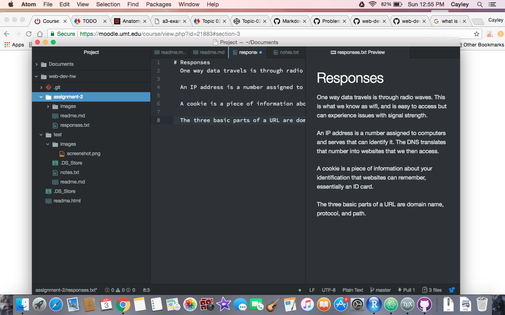

## Assignment 2

A version control system is a type of workspace that records various changes to files so that you can go back and see previos versions of files and the changes that were made in each version. We are utilizing this type of system in our class because it's valuable to be able to look at past mistakes, and it is a cool look at the steps taken to create websites and design.

My [Responses](./responses.txt)

# My Work Cycle
On this project I had somewhat of a difficult time. I went through creating the original test repo, and it was slow going but ok, and then on the actual repo things just kept not working. The formatting was messed up in github, and when I thought I fixed it the problem reappeared with my responses page. I'm still not entirely sure what went wrong, and I'm not sure if it will come up in my repo, so I would probably like to work on that more. I might need a bit of a hand too. 

