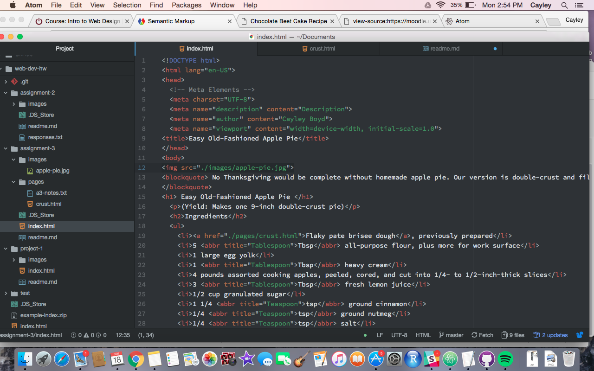

<h1> Read Me - Assignment 3</h1>

<ol><li> How many head and body elements can a page have? How are these elements different, or what role do they play?</li> 
<ul><li> A page can only have one "head" and one "body" element. The head contains all of the information and metadata about the page,
and the body contains everything else. They connect to create the full page with all parts included.</li></ul> 
<li>Describe the difference between structural and semantic markup.</li> 
<ul><li>Structural markup includes the actual nuts and bolts of what gets put on your page, things like headers, lists, and breakers. Semantic markup adds meaningful context, like definitions, sources, and editorial changes.</li>  </ul>

<li>Summarize your work cycle for this assignment. Review this page if you need some ideas.</li> 
<ul><li> For this work cycle, I had pnumonia for two weeks so I was kind of laying low. I got back in it though and I really got back in the groove with this class over the past two days. I like HTML a lot, so this was pretty fun for me.</li></ul> 

<li>Embed a screenshot of your workspace at some point during your development cycle.</li>

