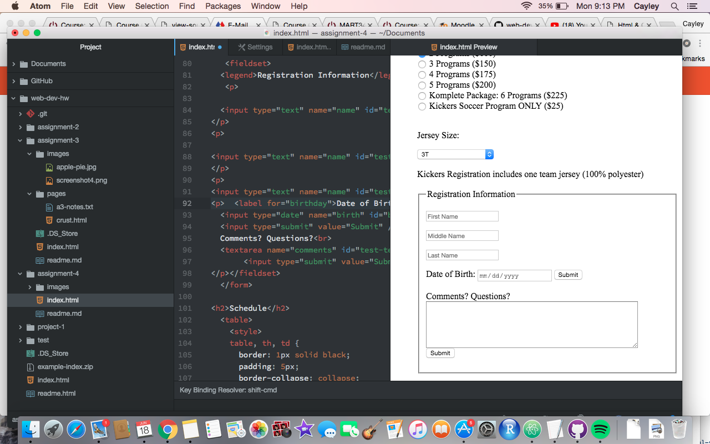

<h1>Read Me - Assignment 4</h1>

<ol><li>What is "alt text," and why do we use it?</li> 
<ul><li>Blah Blah Blah</li></ul> 
<li>Describe any forms you've come across while browsing the web. What purposes do the serve?</li> 
<ul><li>Blah Blah Blah</li></ul> 
<li>Summarize your work cycle for this assignment. Review this page if you need some ideas.</li> 
<ul><li>Blah Blah Blah</li></ul> 
<li>Embed a screenshot of your workspace at some point during your development cycle.</li></ol>

