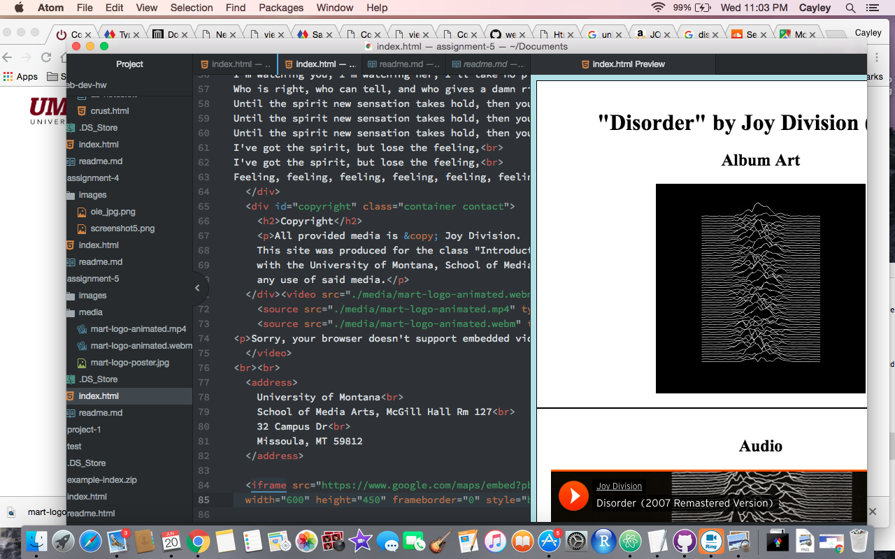

<h1>Read Me - Assignment 5</h1>

<ol><li>Briefly describe the difference between divs, classes, ids, and spans.</li> 
<ul><li>Divs just block up certain peices of information, IDs are unique identification given to each div, classes are NOT unique but used to identify divs and style easily with CSS, and spans are specific labels given to information inside of divs.</li></ul> 
<li>Why might I consider third-party over self-hosted media?</li> 
<ul><li>Media files take up a lot of bandwith, so web hosting services can charge a lot for that, making it prohibitively expensive. Third party sites reduce that bandwith, making it cheaper. Third party sites are also better at making files compatible on a variety of browsers, and they are typically good at protecting their content.</li></ul> 
<li>Summarize your work cycle for this assignment. Review this page if you need some ideas.</li> 
<ul><li>I enjoyed this assignment a lot, I really liked seeing how videos and audio sources are so easily transfered across the web. I found the first half of the assignment to be fairly straightforward, but felt a little lost at the end during the poster and source part, but after reviewing the notes it was much clearer. </li></ul> 
<li>Embed a screenshot of your workspace at some point during your development cycle.</li></ol>

