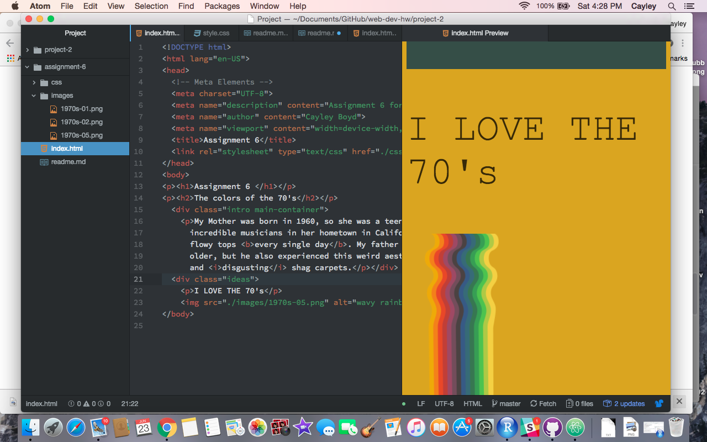

<h1>Read Me - Assignment 6</h1>

<ol><li>Briefly share your design research for this assignment. What graphic or graphics did you choose, from what decade? How did you try to style your "art page" to reflect your exploration of this decade's design trends?</li> 
  <ul>
  <li>I looked up 70's style, but to be honest most of my knowledge comes from my childhood home, which was build in the 70's and really embodies the style. We had pink shag carpets, avacado tiling, and lots of orangey/browns all over the house. I tried to use a lot of those colors and a stylish font to embody the decade. </li></ul> 

<li>Describe your color palette, including the 3 colors you chose. List their color names, rgb values, or hex codes.</li> 
  <ul>
  <li>I used more than 3 colors, and they all were kind of the dullish colors that seemed to be super popular in the 70's. The colors I used were: goldenrod, steelblue, olivedrab, black (but with less opacity), and a tealish color I liked from the tutorial (#173E4E).</li></ul> 

<li>Summarize your work cycle for this assignment. Review this page if you need some ideas.</li> 
  <ul>
  <li>I was a little apprehensive about beginning to learn CSS, but once you kind of get the hang of a stylesheet it is pretty intuitive, just like regular HTML. I went pretty quickly through this one, and found the hardest part for me was chain selectors and figuring out the order things need to go in. I definitely need to prefect my chain game, but I'm happy with the page I ended up with.  </li></ul> 

<li>Embed a screenshot of your workspace at some point during your development cycle.</li></ol>

