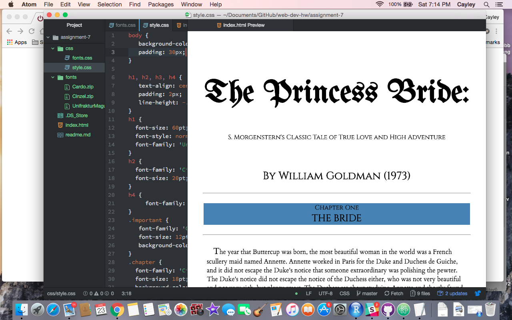

<h1>Read Me - Assignment 7</h1>

<ol><li>Briefly share your design process for this assignment. What fonts did you choose, and why?</li> 
  <ul>
  <li>Since the text I chose was the princess bride, I wanted to use a sort of old-storybook theme, with some medieval text thrown in as well. I thought the font I chose for the paragraphs reads really well, and the subheaders look good too with the font I chose for them. </li></ul> 

<li>What is the difference between a system font, web font, and web-safe font? What is the importance of having fallback fonts or a font stack?</li> 
  <ul>
  <li>System fonts are already installed on my system, available to me but not necessarily the web. Web fonts are hosted on a server and they are made custom for websites. Web safe fonts are shared by both Apple and PC so they can be counted on as available. Fallback fonts are important so that your computer can load the text if the primary font doesn't work for some reason. </li></ul> 

<li>Summarize your work cycle for this assignment. Review this page if you need some ideas.</li> 
  <ul>
  <li>For this assignment I had a really difficult time understanding two things, first how to download the fonts and get them inside of my assignment, and secondly the psuedo elements. I breezed through the first few parts, but then got a little hung up on that stuff. Luckily I just powered through the font downloading process until it worked (a major moment of victory) and the psuedo elements were way easier than I thought they were, they just seemed really intimidating at first. All in all, pretty fun. </li></ul> 

<li>Embed a screenshot of your workspace at some point during your development cycle.</li></ol>

