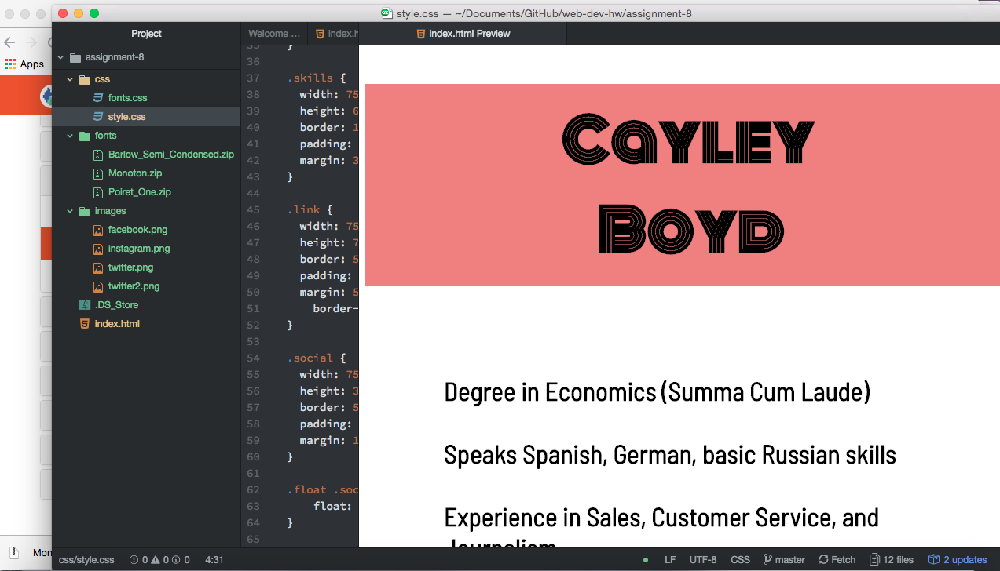

<h1>Read Me - Assignment 8</h1>

<ol><li>What is the difference between padding, margin, and borders?</li> 
  <ul>
  <li>Padding is "the amount of space between the inner content of the element and the element itself", margin is "the space between the box/element and other elements, or the edge of the parent element", and borders surround an element with a line </li></ul> 

<li>What was the hardest task for you to accomplish this assignment? For example, was it overlapping elements, working with sizing, creating layout, or something else entirely?</li> 
  <ul>
  <li>The end complication with hovering and z-indexes threw me for a loop, and at the end I decided to just turn this in. I liked tweaking the margins and padding, that was really fun!</li></ul> 

<li>Summarize your work cycle for this assignment. Review this page if you need some ideas.</li> 
  <ul>
  <li>I started this pretty early, and then got absolutely slammed with working and having to move out of my house, so I kind of dropped the ball at the end. I really have grown to love the fonts, and I think that the color blocking is something I'll definitely want to look more into in the future. Thanks for a great class! </li></ul> 

<li>Embed a screenshot of your workspace at some point during your development cycle.</li></ol>

