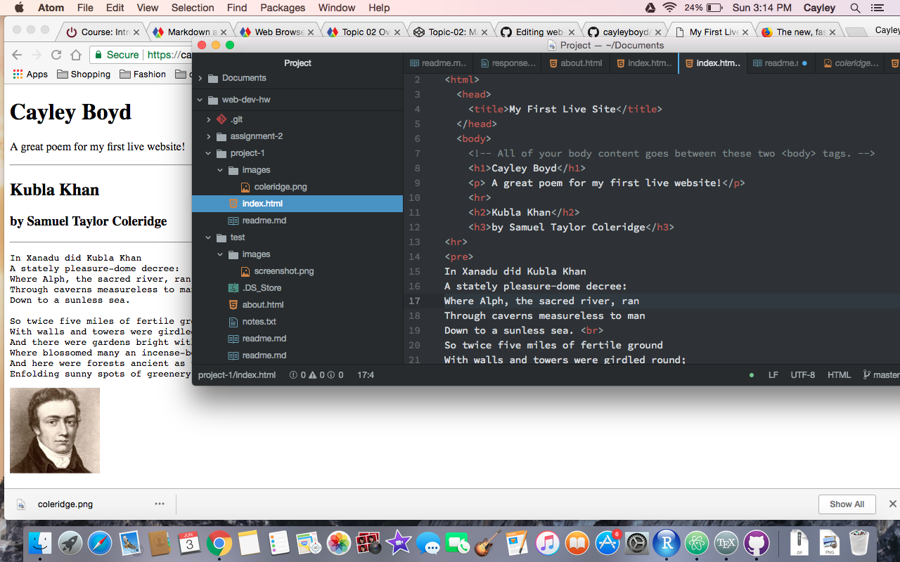

# Project 1 Read Me

## Some Browsers I Use:

<a href="https://www.google.com/chrome/">Google Chrome</a> 
<a href="https://www.mozilla.org/en-US/firefox/">Mozilla Firefox</a> 

Browsers work by recieving web data from servers and interpreting the Javascript so that it can be clearly translated onto a user's computer.

### My Experience With the Wayback Machine

I really had a blast using the wayback machine. I liked to look at the newspaper websites from the 90's, and I also thought that chat rooms like AOL and Yahoo were hilarious to see now. All the pages looked so pixilated and text heavy, with very few images.

### My Work Cycle

I loved this project! I have some experience with HTML and I find it much easier to use than Markup. I chose to go through the html line by line as a review of what I already know. I really found it a helpful review session, and I hope to learn even more. I didn't struggle on much this time, and so I didn't consult the issues forum.

