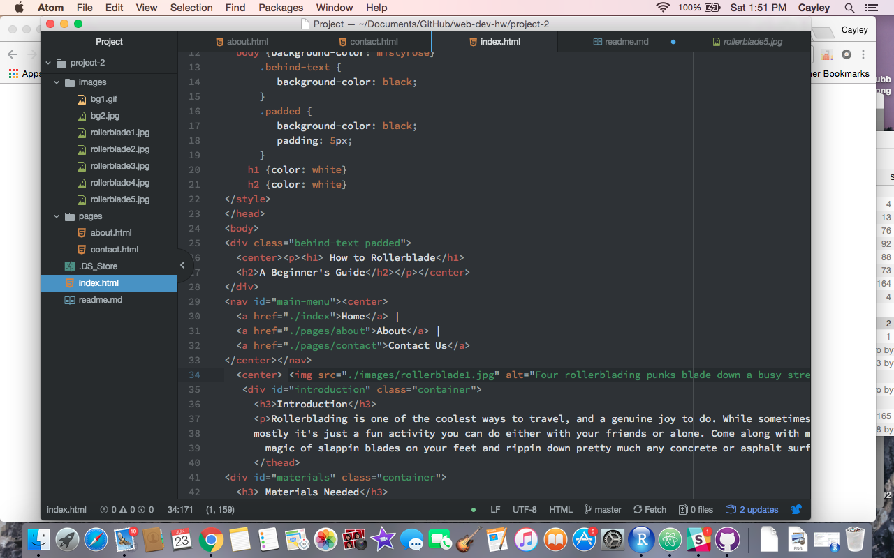

<h1>Read Me - Project 2</h1>

<ol><li>Briefly recap your experience learning HTML. What was old, new, interesting, or difficult to learn?</li> 
  <ul>
  <li>Most of the basic of HTML I had learned from my youth designing and adjusting tumblr themes, but through this course I learned that what I had absorbed from the wild west of tumblr was kind of "guerrilla" HTML, which isn't very pretty and is not really professional looking. The most difficult part of this for me was trying to let go of some of the old coding habits I instinctually still do, but I think it's made me a more thorough and thoughtful designer. </li></ul> 

<li>Next Topic we begin CSS and expand on styling, which helps us "decorate" HTML. Is there anything you're anxious or excited to learn about in this new section?</li> 
  <ul>
  <li>I really like the idea of being able to play with fonts and design, I'm anxious to see how it interacts with what we've already learned. Overall though, I'm happy we will get to learn how to spice up our HTML and make it look much prettier than what we've done so far.</li></ul> 

<li>Summarize your work cycle for this assignment. Review this page if you need some ideas.</li> 
  <ul>
  <li>This project was hard for me. I enjoyed reviewing all the things we had previously done with HTML, but I had a few frustrating moments when my links wouldn't work, or my images wouldn't work, and going back multiple times and trying to fix them was pretty annoying. It taught me a lot about patience though, and I think I grew to have a deeper understanding of what I was doing. At the end my HTML preview on Atom wasn't working, so I had to figure out other ways to view my work. After all of it though I'm proud of what I created. </li></ul> 

<li>Embed a screenshot of your workspace at some point during your development cycle.</li></ol>

